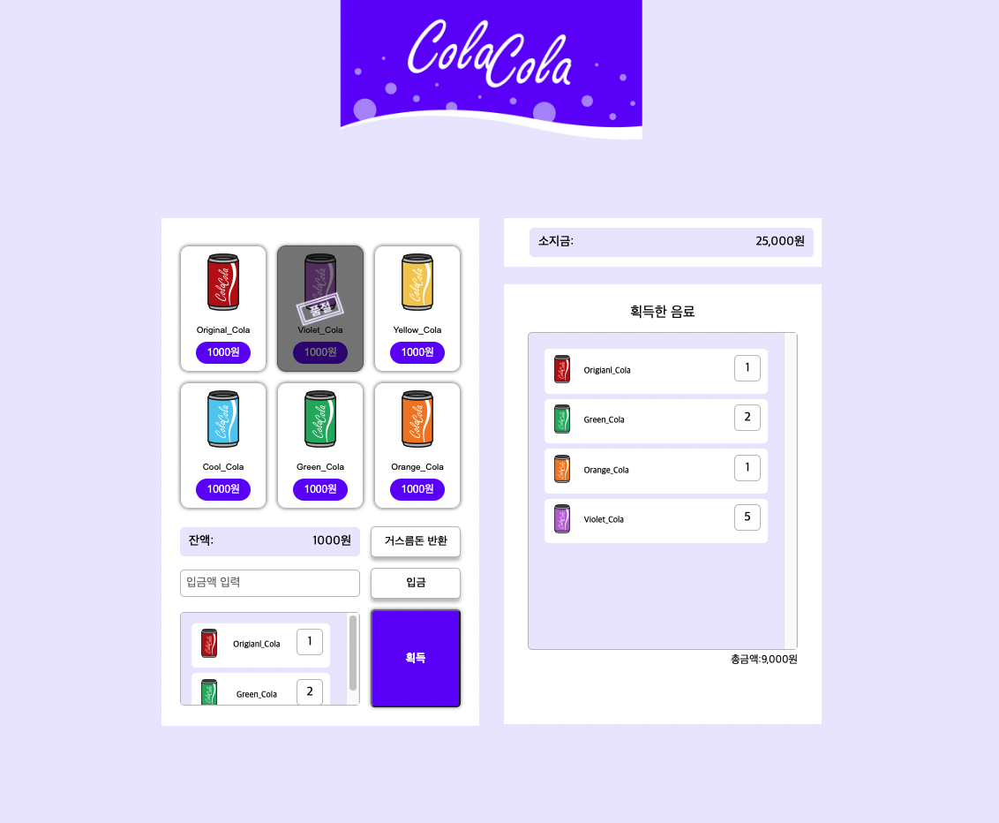
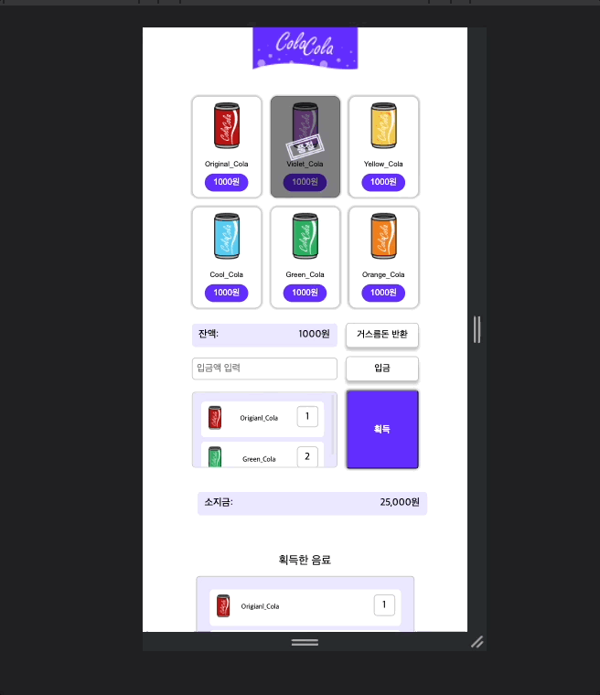

# vending-machine

## 구현화면

- 데스크탑
  

- 모바일
  

결과페이지:https://hun-se.github.io/vending-machine/

## 주요사항

- grid를 사용해서 vending-machine 레이아웃을 구현하였다.

- 고정된 height값을 최대한 안주는것을 목표로 하였다.

- overflow-y:scroll;를 사용해서 리스트에 새로운 요소가 추가되더라도 ui가 꺠지지 않게 구현하여 유지보수가 쉽게 많들었다.

- 미디어쿼리를 사용하여 모바일같이 작은 화면 일떄의 요소들의 변화를 주어 사용성이 좋게 만들어 주었다.

## 배운점

- 기초적인 grid의 사용법을 익힐 수 있게 되었다.
- 미디어 쿼리의 사용법을 알게되었다.

  ```css
  @media only screen and (min-device-width: 320px) and (max-device-width: 480px) and (-webkit-min-device-pixel-ratio: 2) {
  }
  ```

  - `(min-device-width: 320px)`과 같이 원하는 속성값을 입력해주어 화면을 제어 할 수 있다.
  - `-webkit-min-device-pixel-ratio:2`는 레티나디스플레이를 대응하기 위한 속성이다.

- 크롬의 최소 폰트 단위는 10px인것을 확인 할 수 있었다.
- `@charset "utf-8";` 브라우저상에서 한글이 정상적으로 출력하기 위해서 입력해준다.
- 페이지 중간에 갑작스럽게 나오는 list에는 시각장애인 사용자들의 편의성을 위해서 설명을 달아 주는것이 좋다.

  ```css
  <h3 class="head-mycola">획득한 음료</h3>
              <ul class="list-mycola">...
  ```

- 아웃란인이나 가상요소로 기존의 버튼 레이아웃을 침범하지 않게 적용해줄 때 사용하면 좋다.
